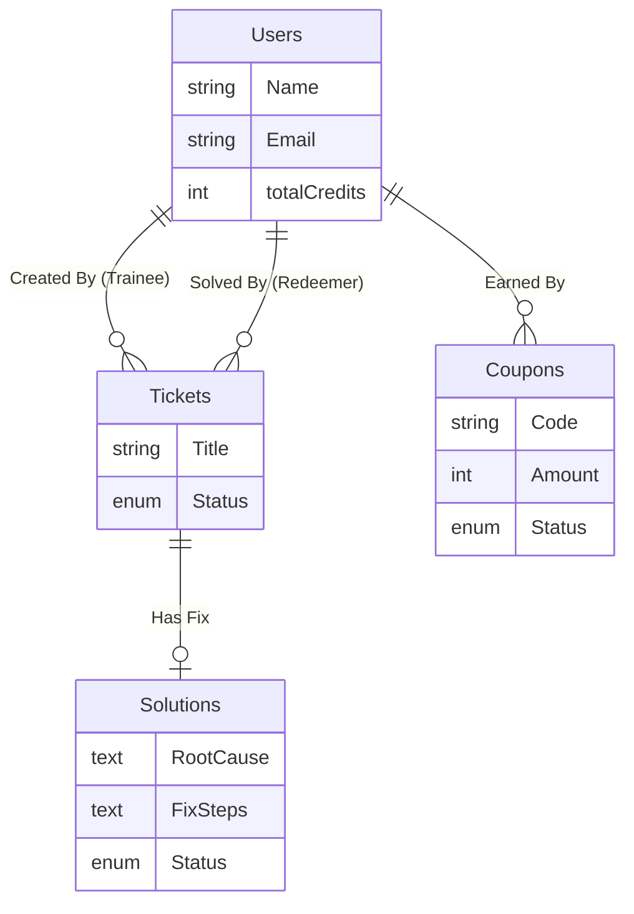
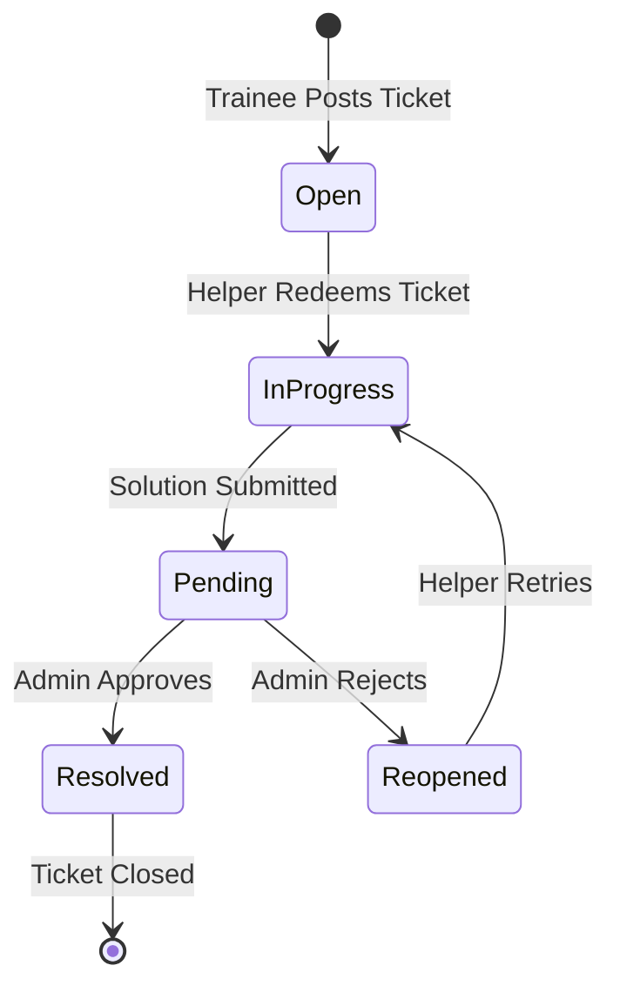

# The Complete Database Guide �

This document explains the **Entire Database** of the application. It is written so that **anyone** (Developer, Manager, or Tester) can understand how data is stored and connected.

---

## 🏗️ The Big Picture (Analogy)

Imagine a **Help Desk Center**:

1.  **Users** are people entering the building. Some are **Trainees** (Customers with problems), and some are **Admins** (Managers).
2.  **Tickets** are the "Complaint Forms" filled out by Trainees. They start as "Open" on a notice board.
3.  **Redemption**: A Helper (another User) walks up to the board, takes a ticket, and says "I'll handle this." Now it's "In Progress".
4.  **Solutions**: The Helper writes down the fix on a "Solution Card" and clips it to the Ticket. It is "Pending Review".
5.  **Approval**: The Manager (Admin) checks the Solution Card.
    -   If good -> Stamps "Approved". The Ticket is "Resolved". The Helper gets Points (Credits).
    -   If bad -> Stamps "Rejected". The Ticket goes back to the "Open" board.

---

## 📊 Visual Diagrams

### 1. Entity Relationship Diagram (The Structure)

Shows how the "Forms" (Tables) are linked.



### 2. Status Lifecycle (The Flow)

Shows the journey of a single Ticket.



---

## 📑 Detailed Data Dictionary

### 1. `Users` Table (The People)
Stores everyone who can log in.

| Column | Type | Why? (Description) |
| :--- | :--- | :--- |
| `id` | UUID | **Unique ID**. Like a Social Security Number for the database. |
| `name` | String | The person's display name. |
| `email` | String | Used for login and notifications. **Must be unique**. |
| `role` | Enum | `'trainee'` (Can create/solve) or `'admin'` (Can approve). |
| `totalCredits` | Int | Scorecard! Points earned from solving tickets. Can be converted to Coupons. |
| `avatar` | String | Filename of their profile picture (e.g., `user-123.jpg`). |

**Example Row:**
```json
{
  "id": "u-101",
  "name": "Alice Developer",
  "email": "alice@example.com",
  "role": "trainee",
  "totalCredits": 550
}
```

---

### 2. `Tickets` Table (The Problems)
Stores the actual work items.

| Column | Type | Why? (Description) |
| :--- | :--- | :--- |
| `id` | UUID | Unique ID for the ticket. |
| `title` | String | "Login is broken" (Short summary). |
| `description` | Text | "When I click login, nothing happens..." (Full details). |
| `status` | Enum | `'open'`, `'in-progress'`, `'resolved'`, `'rejected'`, `'reopened'`. |
| `traineeId` | UUID | **Foreign Key**: Links to `Users.id`. Who created this? |
| `redeemedBy` | UUID | **Foreign Key**: Links to `Users.id`. Who is working on it? (NULL if open). |
| `reusedSolutionId` | UUID | **Foreign Key**: If they used an existing answer, which one? |
| `attachments` | JSON | List of screenshots attached to the ticket. |

**Example Row (In Progress):**
```json
{
  "id": "t-500",
  "title": "Server Crash",
  "status": "in-progress",
  "traineeId": "u-101" (Alice),
  "redeemedBy": "u-102" (Bob)
}
```

---

### 3. `Solutions` Table (The Answers)
Stores the proposed fixes. This builds up the Knowledge Base.

| Column | Type | Why? (Description) |
| :--- | :--- | :--- |
| `id` | UUID | Unique ID for the solution. |
| `ticketId` | UUID | **Foreign Key**: Links to `Tickets.id`. What does this solve? |
| `createdBy` | UUID | **Foreign Key**: Links to `Users.id`. Who wrote this? |
| `rootCause` | Text | "The server ran out of memory." |
| `fixSteps` | Text | "Restarted the service and increased RAM." |
| `status` | Enum | `'pending'` (Wait for Admin), `'approved'` (Good!), `'rejected'` (Bad). |

**Example Row:**
```json
{
  "id": "s-900",
  "ticketId": "t-500",
  "createdBy": "u-102" (Bob),
  "rootCause": "Memory Leak",
  "status": "pending"
}
```

---

### 4. `Coupons` Table (The Rewards)
Stores dummy coupons generated from credits.

| Column | Type | Why? (Description) |
| :--- | :--- | :--- |
| `id` | UUID | Unique ID for the coupon. |
| `userId` | UUID | **Foreign Key**: Links to `Users.id`. Who owns this? |
| `code` | String | Unique coupon code (e.g., `REWARD-1234`). |
| `amount` | Int | Value in Rupees (e.g., `10`). |
| `status` | Enum | `'active'` (Ready to use), `'used'`, `'expired'`. |
| `expiryDate` | Date | When the coupon becomes invalid. |

---

### 5. `Notifications` Table (The Alerts)
Stores history of "Ding!" messages sent to users.

| Column | Type | Why? (Description) |
| :--- | :--- | :--- |
| `userId` | UUID | **Foreign Key**: Who gets this message? |
| `title` | String | "Ticket Resolved" |
| `body` | String | "Your ticket 'Server Crash' has been fixed." |
| `isRead` | Bool | Has the user seen it yet? |

---

### 6. `DeviceTokens` Table (The Phones)
Stores the address to send Push Notifications to.

| Column | Type | Why? (Description) |
| :--- | :--- | :--- |
| `userId` | UUID | **Foreign Key**: Whose phone is this? |
| `token` | String | The address (e.g., `ExpoPushToken[123...]`). |
| `platform` | Enum | `'android'` or `'ios'`. |

---

## 🔍 SQL Cheat Sheet (Common Questions)

**1. "Show me all Open tickets and who created them."**
```sql
SELECT Tickets.title, Users.name 
FROM Tickets 
JOIN Users ON Tickets.traineeId = Users.id 
WHERE Tickets.status = 'open';
```

**2. "Who is the top performer?" (Most credits)**
```sql
SELECT name, totalCredits 
FROM Users 
ORDER BY totalCredits DESC 
LIMIT 1;
```

**3. "Show me the solution for Ticket #500."**
```sql
SELECT Solutions.rootCause, Solutions.fixSteps 
FROM Solutions 
WHERE ticketId = 't-500';
```
